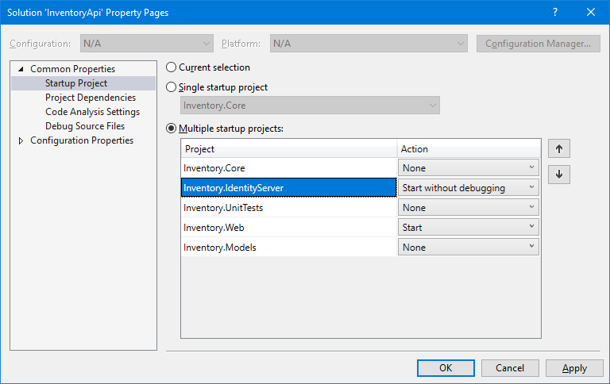
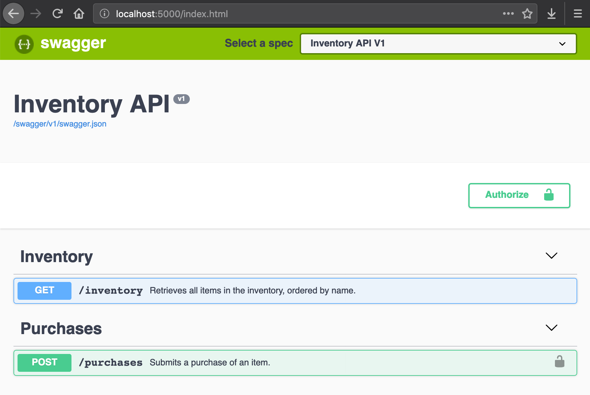

# Inventory API
This is a simple API that allows merchants to browse a shop's inventory and make purchases (available only to authenticated users). It supports the following operations:

| HTTP Verb   | Path         | Request Body | Example Response |
|-------------|--------------|--------------|------------------|
| GET         | `/inventory` | -            | `[ { "id": "64876c5f-0fc1-4a48-974e-da66d9c05630", "name": "+5 Dexterity Vest", "description": "+5 Dexterity Vest", "price": 10, "availableUnits": 25 }, ... ]` |
| POST        | `/purchases` | `{ "itemId": "52243256-455e-4376-9cac-39fbe1c7cb42", "quantity": 2 }` | `{ "status": "Completed", "totalPrice": 20 }` |

## Run API
The API uses an in-memory database and can be run locally by using the following commands (assuming that you are in the root folder of the repository).

```console
dotnet run -p src/Inventory.IdentityServer/Inventory.IdentityServer.csproj
dotnet run -p src/Inventory.Web/Inventory.Web.csproj
```

Another option is to use Visual Studio and select both `Inventory.IdentityServer` and `Inventory.Web` as startup projects.



After the application starts, you should be able to navigate to `http://localhost:5000` in your web browser (or invoke the API via cURL).



```console
curl "http://localhost:5000/inventory?limit=1" --verbose --include
```

## Authentication

## Tests
This API has two types of tests:

1. Unit tests
    - Validate if the API interface is implemented correctly (i.e. the appropriate HTTP status codes are returned)
2. Integration tests
    - Check if protected operations can be accessed by unauthenticated users.
    - Validate the application request-response pipeline

The unit tests can be run with the following command
```console
dotnet test tests/Inventory.UnitTests/Inventory.UnitTests.csproj
```

The integration tests, on the other hand, require the identity management system to be running as well.
```console
dotnet run -p src/Inventory.IdentityServer/Inventory.IdentityServer.csproj
dotnet test tests/Inventory.IntegrationTests/Inventory.IntegrationTests.csproj
```

## Business Rules
