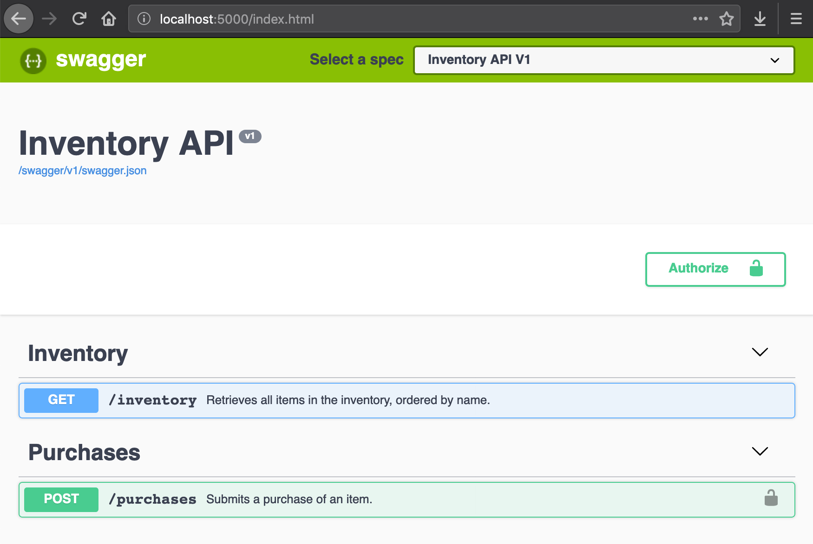
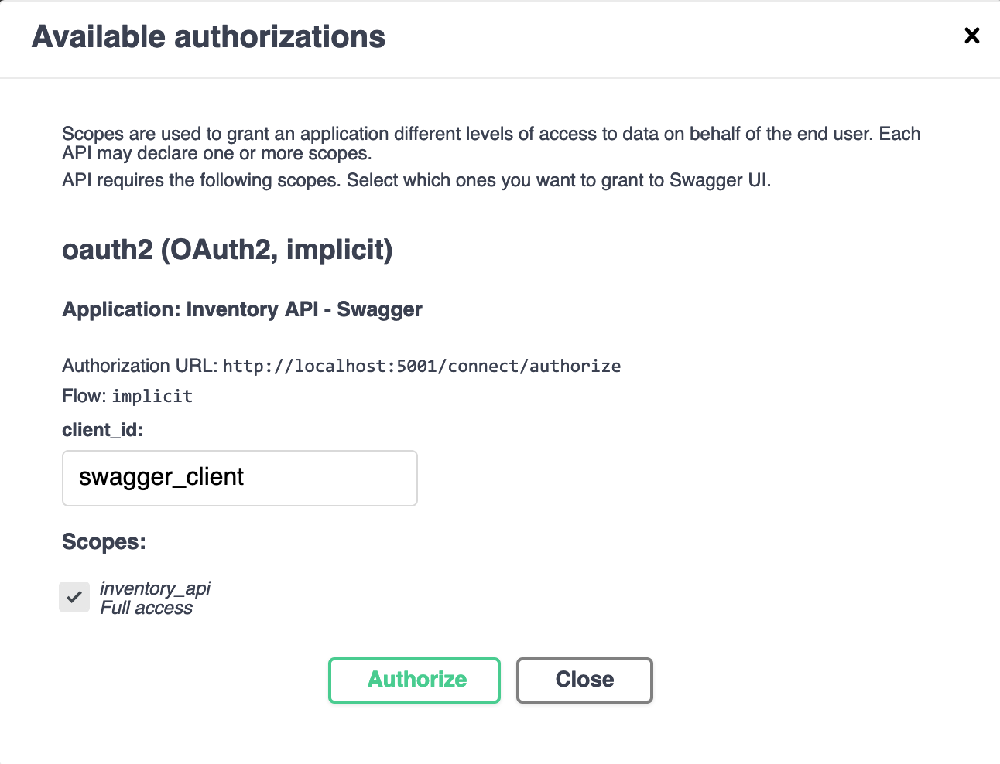
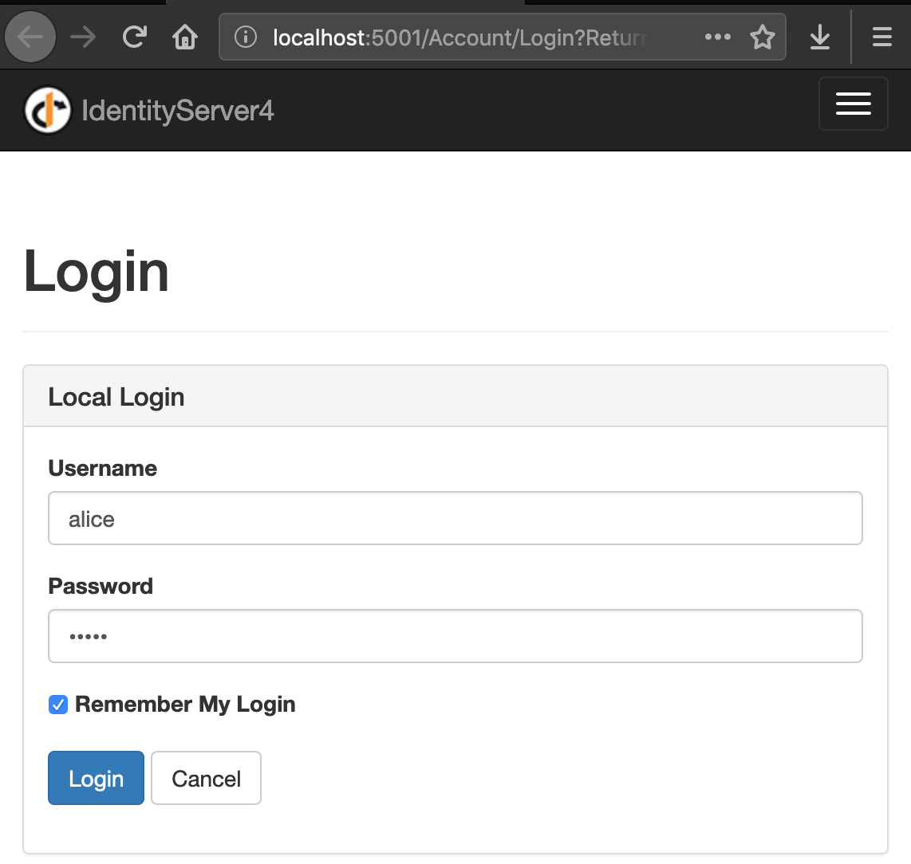
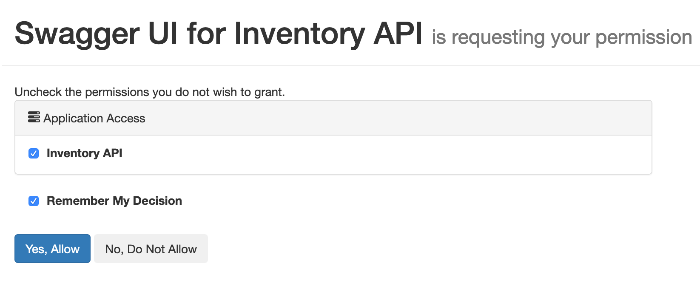

# Inventory API
This is a simple API that allows merchants to browse a shop's inventory and make purchases (available only to authenticated users). It supports the following operations:

| HTTP Verb   | Path         | Request Body | Example Response |
|-------------|--------------|--------------|------------------|
| GET         | `/inventory` | -            | `[ { "id": "64876c5f-0fc1-4a48-974e-da66d9c05630", "name": "+5 Dexterity Vest", "description": "+5 Dexterity Vest", "price": 10, "availableUnits": 25 }, ... ]` |
| POST        | `/purchases` | `{ "itemId": "52243256-455e-4376-9cac-39fbe1c7cb42", "quantity": 2 }` | `{ "status": "Completed", "totalPrice": 20 }` |

## Run API
The API uses an in-memory database and can be run locally by using these commands (assuming that you are in the root folder of the repository):

```console
dotnet run -p src/Inventory.IdentityServer/Inventory.IdentityServer.csproj
dotnet run -p src/Inventory.Web/Inventory.Web.csproj
```

Another option is to use Visual Studio and select both `Inventory.IdentityServer` and `Inventory.Web` as startup projects.


After the application starts, you should be able to navigate to `http://localhost:5000` in your web browser (or invoke the API via cURL).



```console
curl "http://localhost:5000/inventory?limit=1" --verbose --include
```

## Authentication
The authentication mechanism chosen for this API was the [Identity Server](http://docs.identityserver.io/en/latest/) framework. The main reason for this decision was the fact that it has the ability to issue access tokens for multiple types of clients (server to server, native / mobile apps, SPAs, etc.) out of the box. It also integrates well with the Swagger UI (making testing straightforward) and the .NET core authentication middleware (allowing operations to be protected with the `Authorize` attribute).

In this implementation, the configuration details (users, clients, and resources) are stored in memory, but Identity Server also supports saving them in a persistent data store.

Here's a step by step on the authorization workflow via UI:

1. Click on the `Authorize` button in the Swagger UI
2. Select the `inventory_api` scope and click `Authorize`: 
3. This will redirect you to the Identity Server login page: 
4. Enter the credentials for one of the [predefined users](src/Inventory.IdentityServer/Quickstart/TestUsers.cs)
5. Confirm that `Inventory API` is selected in the Application Access list and click `Yes, Allow`: 
6. You will be redirected back to the Swagger UI, and all requests to protected operations will automatically include the access token

## Business Rules
Here's how the API determines if it is possible for an item to be bought:

1. Each item in the inventory has a finite number of available units
2. Once a purchase request is received, the following checks are made:
    - Does the item exist?
    - Does the item have any available units (i.e. is available units greater than zero)?
    - Can the quantity in the request be fulfilled (i.e. is available units less than or equals to the request quantity)?
3. If any of those fail, the item cannot be bought
4. Otherwise, the purchase is registered and the number of available units is updated to reflect the new current inventory state

## Tests
This API has two types of tests:

1. Unit tests
    - Check that items can only be bought if there are enough units in the inventory
    - Validate if the API interface is implemented correctly (i.e. the appropriate HTTP status codes are returned)
2. Integration tests
    - Check that protected operations can only be accessed by authenticated users
    - Validate the application request-response pipeline (e.g. model binding)

The unit tests can be run with this command:
```console
dotnet test tests/Inventory.UnitTests/Inventory.UnitTests.csproj
```

The integration tests, on the other hand, require the identity management system to be running as well:
```console
dotnet run -p src/Inventory.IdentityServer/Inventory.IdentityServer.csproj
dotnet test tests/Inventory.IntegrationTests/Inventory.IntegrationTests.csproj
```
